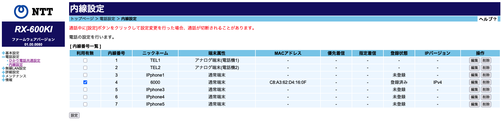

# Asterisk×ガラケーで家電話を純正アプリから送受信したい！！
## 皆さんは家電話を何で受けていますか？

一般のというかとりあえず家に家電があるという方は普通のPanasonicやPioneerのものがとりあえずあるという形だと思います。
私も家の電話は代々PanasonicのFax機能付きのモデルを使っていました。
### ん？そもそも家に電話がないって？携帯で十分だって？
## ロマンが足りないですね〜
私も半分いらないな〜って思いながらも維持しているのですが、私よりも家族の人間が家の電話がないと友人や親戚と連絡が取りにくいということなので維持しています。
それとほぼ同じ理由で家族の人間が仕事で使うのでFax機能も維持しています。

### ただぁ！
Faxのインクフィルムって結構良いお値段するんですよ、

https://panasonic.jp/consumables/products/KX-FAN191.html

たまにしか使わないとは言え家にプリンターがあってしかもそれがインジェット型の大容量タンクを持っているCanon Gシリーズがあるのでかなり勿体無い気がします。

#### ではどうしましょうか？
## 家の電話にAsteriskを導入しよう！
### 皆さんの家の電話はどこから来ていますか？
ほとんどの人はNTTの設備、HGWなどからRJ11(電話線)を使ってPanasonicの電話機に繋がっていると思います。
私の家でもRX-600KIが光ファイバーから光電話という形で電話回線を収容しています。
#### おーそーらーく、ほとんどの人がRXシリーズから光電話から変換で電話設備に繋がっていると思います。
というかもうNTTはメタルのみの[公衆交換電話網（PSTN）](https://www.ntt-west.co.jp/denwa/2035denwa/)での固定電話サービスの提供を終了し今後はIP回線を利用した回線へと変わっていきます。
では単純にIP電話をAsteriskに収容してみましょう

